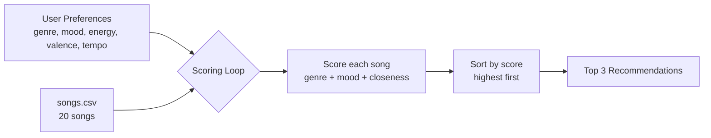

# 🎵 Music Recommender Simulation

## Project Summary

In this project you will build and explain a small music recommender system.

Your goal is to:

- Represent songs and a user "taste profile" as data
- Design a scoring rule that turns that data into recommendations
- Evaluate what your system gets right and wrong
- Reflect on how this mirrors real world AI recommenders

My version is a tiny simulation of what Spotify or YouTube Music do when they build a "Made For You" playlist. It takes a user's taste (what genre, mood, energy they like) and scores every song in the catalog to pick the best matches.

---

## How The System Works

Real apps like Spotify mix two big ideas: **collaborative filtering** (looking at what people with similar taste listened to) and **content-based filtering** (looking at the actual song attributes — tempo, energy, genre). They also track tons of signals: likes, skips, replays, how long you listened, what time of day it is, what playlist the song came from. All of that gets fed into a model that predicts "will this user like this song?"

My version is way simpler. I'm only doing **content-based filtering**, because I don't have a bunch of other users' data — just one user and a CSV of songs. My recommender compares what the user says they like to each song's features, gives every song a score, ranks them from highest to lowest, and shows the top 3.

### What each object stores

**`Song` features used:**
- `genre` (pop, lofi, rock, etc.)
- `mood` (happy, chill, intense, focused...)
- `energy` (0 to 1, how intense it feels)
- `valence` (0 to 1, how happy it sounds)
- `tempo_bpm` (speed in beats per minute)

**`UserProfile` stores:**
- `preferred_genre` (one string, like "lofi")
- `preferred_mood` (one string, like "chill")
- `preferred_energy` (a number 0–1)
- `preferred_valence` (a number 0–1)
- `preferred_tempo` (a number, like 80)

### How the Recommender scores a song

For the text features (genre, mood) I just check if they match — if they do, add the weight, if not, add 0.

For the number features (energy, valence, tempo) I use a **closeness** formula so songs close to what the user wants score high:

```
closeness = 1 - abs(song_value - user_preference)
```

(For tempo I divide by a max first so it's on the same 0–1 scale.)

Then I add it all up with weights:

```
score = 2.0 * genre_match
      + 1.0 * mood_match
      + 1.5 * energy_closeness
      + 1.0 * valence_closeness
      + 1.0 * tempo_closeness
```

Genre gets the biggest weight (2.0) because switching genres feels like a bigger deal than switching mood inside a genre.

### How songs get picked

After every song has a score, I sort the list from highest to lowest and return the top 3. That's the "ranking rule" — scoring alone just gives numbers, ranking turns those numbers into an actual recommendation list.

---

### My Dataset

My `data/songs.csv` has 20 songs covering these genres: pop, lofi, rock, ambient, jazz, synthwave, indie pop, classical, edm, country, world, hip hop, blues, techno, folk, r&b. Moods range from chill and happy to intense, melancholy, nostalgic, confident, and hype. Each song has these columns:

`id, title, artist, genre, mood, energy, tempo_bpm, valence, danceability, acousticness`

### My User Profile (the "taste dictionary")

I'm testing with one user whose taste is "chill lofi study vibes":

```python
user_profile = {
    "favorite_genre": "lofi",
    "favorite_mood": "chill",
    "target_energy": 0.4,
    "target_valence": 0.6,
    "target_tempo": 80,
}
```

This profile should clearly separate "intense rock" from "chill lofi" because the genre preference alone pulls 2.0 points, and the energy/tempo numbers are nowhere close to rock values (rock is around 0.9 energy, 150 bpm). An intense rock song would lose on all five dimensions, while a chill lofi song wins on all five.

### Algorithm Recipe (final)

```
For each song in the catalog:
    score = 0
    if song.genre == user.favorite_genre:   score += 2.0
    if song.mood  == user.favorite_mood:    score += 1.0
    score += 1.5 * (1 - abs(song.energy  - user.target_energy))
    score += 1.0 * (1 - abs(song.valence - user.target_valence))
    score += 1.0 * (1 - abs(song.tempo_bpm - user.target_tempo) / 200)

Sort all songs by score (highest first)
Return the top 3
```

### Data Flow Diagram



### Sample CLI Output

Running `python -m src.main` with the default profile `{"genre": "pop", "mood": "happy", "energy": 0.8}`:

```
Loaded songs: 20

User preferences: {'genre': 'pop', 'mood': 'happy', 'energy': 0.8}
==================================================

Top recommendations:

1. Sunrise City by Neon Echo
   Score: 4.47
   Because: genre match: pop (+2.0); mood match: happy (+1.0); energy close to 0.8 (+1.47)

2. Gym Hero by Max Pulse
   Score: 3.30
   Because: genre match: pop (+2.0); energy close to 0.8 (+1.30)

3. Rooftop Lights by Indigo Parade
   Score: 2.44
   Because: mood match: happy (+1.0); energy close to 0.8 (+1.44)

4. Sunday Brunch by Tangerine Trio
   Score: 2.08
   Because: mood match: happy (+1.0); energy close to 0.8 (+1.08)

5. Cypher Nights by MC Axis
   Score: 1.50
   Because: energy close to 0.8 (+1.50)
```

"Sunrise City" correctly tops the list — it's the only song that matches all three preferences (pop + happy + energy near 0.8). (Screenshot of this terminal output goes here.)

### Biases I Expect

- **Over-weighting genre.** Because genre is worth 2.0 (the biggest single chunk), a lofi song with the wrong mood could beat a jazz song with the perfect mood. I might miss great cross-genre matches.
- **Exact-match-only for text fields.** "pop" and "indie pop" are treated as totally different, even though they're close. The system can't see genre *similarity*, only *equality*.
- **Cold-start friendly but filter-bubbly.** Since I only use song attributes (no other users), a new song works fine — but the user will never get surprised by something outside their stated taste. No serendipity.
- **Tempo normalization is hacky.** I divide by 200 to squash bpm to 0–1. A 60 bpm song and a 160 bpm song are 0.5 apart, which might under-penalize big tempo gaps.

---

## Getting Started

### Setup

1. Create a virtual environment (optional but recommended):

   ```bash
   python -m venv .venv
   source .venv/bin/activate      # Mac or Linux
   .venv\Scripts\activate         # Windows

2. Install dependencies

```bash
pip install -r requirements.txt
```

3. Run the app:

```bash
python -m src.main
```

### Running Tests

Run the starter tests with:

```bash
pytest
```

You can add more tests in `tests/test_recommender.py`.

---

## Experiments You Tried

Use this section to document the experiments you ran. For example:

- What happened when you changed the weight on genre from 2.0 to 0.5
- What happened when you added tempo or valence to the score
- How did your system behave for different types of users

---

## Limitations and Risks

Summarize some limitations of your recommender.

Examples:

- It only works on a tiny catalog
- It does not understand lyrics or language
- It might over favor one genre or mood

You will go deeper on this in your model card.

---

## Reflection

Read and complete `model_card.md`:

[**Model Card**](model_card.md)

Write 1 to 2 paragraphs here about what you learned:

- about how recommenders turn data into predictions
- about where bias or unfairness could show up in systems like this


---

## 7. `model_card_template.md`

Combines reflection and model card framing from the Module 3 guidance. :contentReference[oaicite:2]{index=2}  

```markdown
# 🎧 Model Card - Music Recommender Simulation

## 1. Model Name

Give your recommender a name, for example:

> VibeFinder 1.0

---

## 2. Intended Use

- What is this system trying to do
- Who is it for

Example:

> This model suggests 3 to 5 songs from a small catalog based on a user's preferred genre, mood, and energy level. It is for classroom exploration only, not for real users.

---

## 3. How It Works (Short Explanation)

Describe your scoring logic in plain language.

- What features of each song does it consider
- What information about the user does it use
- How does it turn those into a number

Try to avoid code in this section, treat it like an explanation to a non programmer.

---

## 4. Data

Describe your dataset.

- How many songs are in `data/songs.csv`
- Did you add or remove any songs
- What kinds of genres or moods are represented
- Whose taste does this data mostly reflect

---

## 5. Strengths

Where does your recommender work well

You can think about:
- Situations where the top results "felt right"
- Particular user profiles it served well
- Simplicity or transparency benefits

---

## 6. Limitations and Bias

Where does your recommender struggle

Some prompts:
- Does it ignore some genres or moods
- Does it treat all users as if they have the same taste shape
- Is it biased toward high energy or one genre by default
- How could this be unfair if used in a real product

---

## 7. Evaluation

How did you check your system

Examples:
- You tried multiple user profiles and wrote down whether the results matched your expectations
- You compared your simulation to what a real app like Spotify or YouTube tends to recommend
- You wrote tests for your scoring logic

You do not need a numeric metric, but if you used one, explain what it measures.

---

## 8. Future Work

If you had more time, how would you improve this recommender

Examples:

- Add support for multiple users and "group vibe" recommendations
- Balance diversity of songs instead of always picking the closest match
- Use more features, like tempo ranges or lyric themes

---

## 9. Personal Reflection

A few sentences about what you learned:

- What surprised you about how your system behaved
- How did building this change how you think about real music recommenders
- Where do you think human judgment still matters, even if the model seems "smart"

